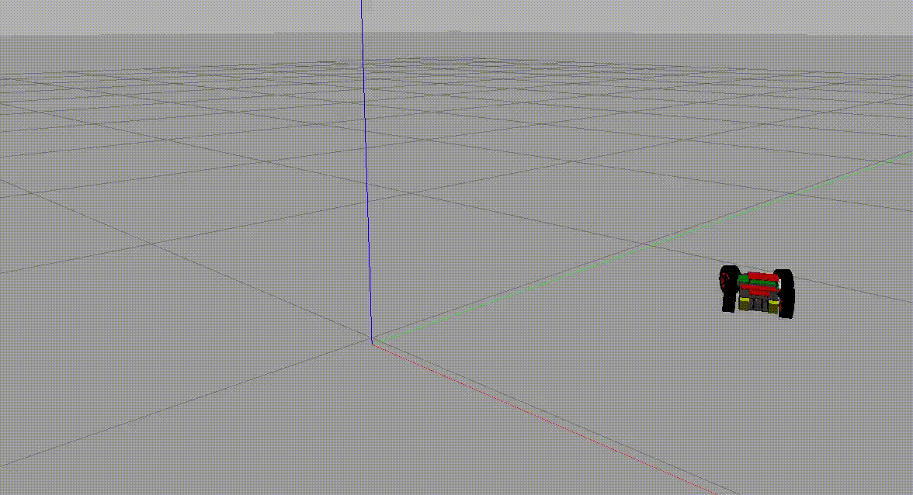

# Digital Twin Prototype of a PiCar-X
The goal of this project is to give an insight into practice and how the developed of IIoT applications changes.We demonstrate the basic idea of a Digital Twin (Prototype) by the example of a PiCar-X by Sunfounder.
This project was implemented with via ROS packages, which can be connected to a Gazebo simulation.



# Activate GPIO and I2C on Your System
This project based on ROS and Docker. Due to the used interfaces on the RPi, we have to use Linux Kernel functions for GPIO and I2C. Before you can start this project you have to activate GPIO and I2C. If you already activated these modules, you can proceed with ##. Otherwise you have to build these modules first.

- [Install on Ubuntu 20.04](#build-new-linux-kernel)
- [Install on Windows (with WSL2)](#build-new-windows-wsl2-kernel)

<strong>If you are using this project with WSL2, you also have to [install and start the XLaunch](#xlaunch-for-windows). Otherwise you can start Gazebo with Docker.</strong>

If you already have built the modules, you can activate them via 
```console 
    sudo modprobe gpio-mockup gpio_mockup_ranges=1,41
    sudo modprobe i2c-dev
    sudo modprobe i2c-stub chip_addr=0x14
```

# Start with Docker compose

You can start the whole Digital Twin Prototype with the <em>docker-compose</em> file in this folder. We use a core container, where all other containers are built on. When you built the containers the first time, you have to build the core container first.

```console

    docker compose -f docker-compose-dtp.yml build picarx
```

Create a Docket network.

```console
    docker network create picarx
```

Afterwards, you can build all containers and start the Digital Twin Prototype when all containers are built.

```console 
    docker compose -f docker-compose-dtp.yml build
    docker compose -f docker-compose-dtp.yml up
```

## Let the DTP drive

After you start all Docker containers, you can switch into one of the containers and publish a picarx_msgs/Drive message, which will move the DTP with a certain speed and steering angle.

```console
    # SWITCH INTO THE CONTAINER
    docker exec -it picar-x-ackermann_skill-dtp-1 /bin/bash

    # INSIDE CONTAINER:
    source /root/catkin_ws/devel/picarx_ackermann_drive/setup.bash

    # PUBLISH A MESSAGE TO TURN RIGHT WITH 50 percent motor speed
    rostopic pub /picarx/drive/command picarx_msgs/Drive "{speed: 50, angle: 20}"

    # PUBLISH A MESSAGE TO TURN LEFT WITH 80 percent motor speed
    rostopic pub /picarx/drive/command picarx_msgs/Drive "{speed: 80, angle: -20}"
```

# Example Integration Tests

In this project we also demonstrate how to execute small integration tests with ROS and Docker. The drivers of the clutchgear and the DC Motor have integration tests
in their <em>tests</em> folders.

```console
# CLUTCHGEAR DRIVER (Steering)
docker run --rm --name test -v /sys/class/gpio:/sys/class/gpio -v /dev/i2c-0:/dev/i2c-0 --privileged -it picarx/drivers/clutchgear:latest /bin/bash -c "source ./devel/picarx_clutchgear_driver/setup.bash 
&& rostest picarx_clutchgear_driver integration_tests.test"" 

# DC MOTOR DRIVER
docker run --rm --name test -v /sys/class/gpio:/sys/class/gpio -v /dev/i2c-0:/dev/i2c-0 --privileged -it picarx/drivers/dcmotor:latest /bin/bash -c "source ./devel/picarx_dcmotor_driver/setup.bash && rostest picarx_dcmotor_driver integration_tests.test"
```

# Build new Windows WSL2 Kernel

WSL2 Kernel can be found on [the official WSL2 Linux Kernel GitHub page](https://github.com/microsoft/WSL2-Linux-Kernel).

```console
uname -r

# Possible Output: 
5.10.102.1-microsoft-standard-WSL2


sudo apt-install wget unzip build-essential flex bison libssl-dev libelf-dev dwarves

wget https://github.com/microsoft/WSL2-Linux-Kernel/releases/tag/linux-msft-wsl-5.10.102.1.zip
unzip linux-msft-wsl-5.10.102.1.zip

cp ./Microsoft/config-wsl .config

# ALTERNATIVE 1 (activate the modules via GUI):
make menuconfig

# ALTERNATIVE 2 (write the modules to file):
echo CONFIG_GPIOLIB=y >> .config
echo CONFIG_GPIO_SYSFS=y >> .config             
echo CONFIG_GPIO_CDEV=y >> .config
echo CONFIG_GPIO_CDEV_V1=y >> .config
echo CONFIG_GPIO_MOCKUP=m   >> .config           
echo CONFIG_I2C_CHARDEV=m >> .config
echo CONFIG_I2C_STUB=m >> .config


make KCONFIG_CONFIG=.config -j $NumberOfCores    # if you have 4 cores, just type 4 (the more the better)
```

## Activate new WSL2 Kernel:

Create a folder where you will copy the Kernel from the WSL2 VM to Windows, for example C:\WSLKernel. Then
go back to your Linux console and copy the bzImage and shutdown the WSL2 VM:

```console
# IN WSL:
cp arch/x86/boot/bzImage /mnt/c/WSLKernel

# SHUTDOWN WSL2 VIA POWERSHELL
wsl --shutdown
```

Back on Windows you know have to copy the <em>bzImage</em> to the kernel folder <em>C:\Windows\System32\lxss\tools</em>
Then rename the <em>kernel</em> file to <em>kernel.old</em>, <strong>do not delete it</strong>! If something went wrong, you can just restore the old working kernel. 

After you copied the <em>bzImage</em> into the folder, rename <em>bzImage</em> to <em>kernel</em>. Afterwards, start Ubuntu again and go into the WSL2 Kernel folder from the privious steps and install the modules via:

```console
make modules_install
```

If you built and installed the new kernel properly, you should now be able to [activate GPIO and I2C](#activate-gpio-and-i2c-on-your-system). 

## Build new Linux-Kernel

Download your prefered Kernel version:

First check your Kernel version on your system:

```console
uname -r

# POSSIBLE RESULT:
On Ubuntu 20.04: 5.13.0-48-generic
```

Install all the modules required for the Kernel's building

```
sudo apt-install wget unzip build-essential flex bison libssl-dev libelf-dev dwarves ncurses-dev zstd
```

### Build with Linux

```console
uname -r

# POSSIBLE RESULT:
On Ubuntu 20.04: 5.13.0-48-generic

sudo apt-install wget unzip build-essential flex bison libssl-dev libelf-dev dwarves ncurses-dev zstd

wget https://mirrors.edge.kernel.org/pub/linux/kernel/v5.x/linux-5.13.tar.gz

tar xf linux-5.13.tar.gz

cd linux-5.13/

make clean && make mrproper

cp /usr/lib/modules/$(uname -r)/build/.config ./

# ALTERNATIVE 1 (activate the modules via GUI):
make menuconfig

# ALTERNATIVE 2 (write the modules to file):
echo CONFIG_GPIOLIB=y >> .config
echo CONFIG_GPIO_SYSFS=y >> .config             
echo CONFIG_GPIO_CDEV=y >> .config
echo CONFIG_GPIO_CDEV_V1=y >> .config
echo CONFIG_GPIO_MOCKUP=m   >> .config           
echo CONFIG_I2C_CHARDEV=m >> .config
echo CONFIG_I2C_STUB=m >> .config

make scripts

# Disable the key options, otherwise the kernel may wont be built properly
scripts/config --disable CONFIG_SYSTEM_REVOCATION_KEYS
scripts/config --disable CONFIG_SYSTEM_TRUSTED_KEYS


# This will take quite some time, with more cores you are faster
make -j #NumberOfCores
make bzImage
make modules_install
make install

sudo update-grub

sudo reboot
```

After reboot you can check if your new kernel is activated by:

```consle
uname -r

# Result should be the Kernel version you wanted to install, e.g.:
linux-5.13
```

If you built and installed the new kernel properly, you should now be able to [activate GPIO and I2C](#activate-gpio-and-i2c-on-your-system). 

## XLaunch for Windows

[Download the VcXsrv X Server for Windows](https://sourceforge.net/projects/vcxsrv/).
Start the application with following configuration:

1. First Screen: Multiple Windows
2. Second Screen: Start no client
3. Third Screen: Deactivate "<em>Native opengl</em>"
4. Fourth Screen: Start

# Troubleshooting

<strong>Problem 1: /dev/I2C-X is busy:</strong>

If you started the Docker compose file before you activated I2C, than a folder named /dev/I2C-X was created on your system, due to the mounting of volumes.

<em>Solution:</em> Remove the folder via 

```console
sudo rm -r /dev/i2c-x
```

And [activate I2C](#activate-gpio-and-i2c-on-your-system)

<strong>Problem 2: GPIO ports exist after the containers crashed/were killed.</strong>

If you use CTRL+C more than once, you kill the containers instead of stopping them. Although deleting the GPIO pins is part of the shutdown routine, this is skipped if the containers crash or get killed.

<em>Solution:</em> 
Try to unexport the pins manually.

```console
echo 24 > /sys/class/gpio/unexport
echo 23 > /sys/class/gpio/unexport
```
If this does not work, due to permission issues, than reboot your WSL2 or Linux System.

## Testing the Digital Shadow

```console
docker exec -it picar-x-drive_monitor-1 /bin/bash
source install/setup.bash

rostopic pub /drive/status picarx_msgs/DriveStatus "{ 'header': { 'skillID': '1', 'topicID': '0'}, 'timestamp': {'secs': 0, 'nsecs': 0}, 'motor_left': { 'location': 0, 'direction': 1, 'speed': 300}, 'motor_right': {'location': 1, 'direction': -1, 'speed': 300}, 'clutchgear': { 'location': 0, 'pulsewidth': 180}}"
```
